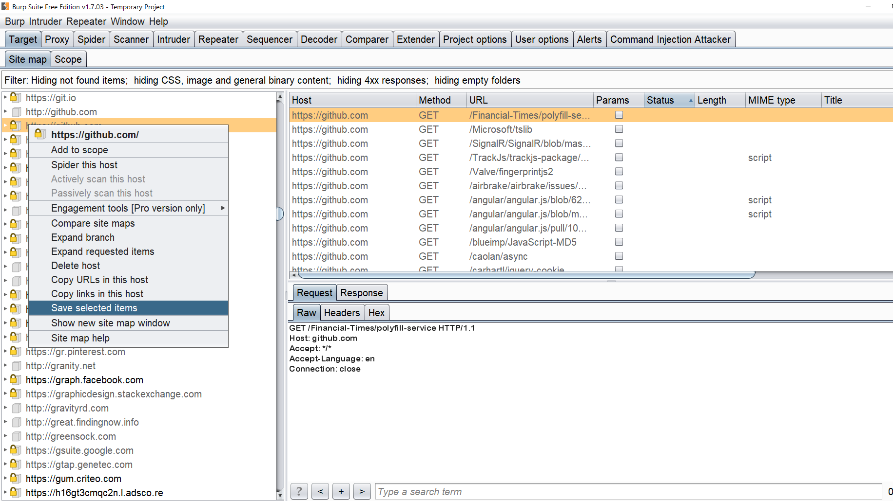

# SSRF-Scanner

A Python based scanner to find potential SSRF parameters in a web application.

## Features

1) Takes burp's sitemap as input and parses and parses the file with a strong regex matches any GET/POST URL parameters containing potentially vulnerable SSRF keywords like URL/website etc. Also,
checks the parameter values for any URL or IP address passed.
Examples
```
GET request -
google.com/url=https://yahoo.com 
google.com/q=https://yahoo.com 
FORMS -
<input type="text" name="url" value="https://google.com" placeholder="https://msn.com">
```

2) Multi-threaded In-built crawler to run and gather as much data as possible to parse and identify potentially vulnerable SSRF parameters.


3) Supply cookies for an authenticated scanning.


4) By default, normal mode is On, with a verbose switch you would see the same vulnerable param in different endpoints. The same parameter may not be sanitized at all places. But verbose mode generates a lot of noise.
Example:
```
https://google.com/path/1/urlToConnect=https://yahoo.com 
https://google.com/differentpath/urlToConnect=https://yahoo.com
```
5) Exploitation - Makes an external request to burp collaborator or any other http server with the vulnerable parameter to confirm the possibility of SSRF. 

## How to use?
[-] This would run with default threads=10, no cookies/session and NO verbose mode <br/>
`python3 ssrf-scanner.py -H https://www.google.com`


[-] Space separate Cookies can be supplied for an authenticated session crawling <br/>
`python3 ssrf-scanner.py -H https://www.google.com -c cookie_name1=value1 cookie_name2=value2`


[-] Supplying no. of threads and verbose mode (Verbose Mode Is Not Recommended If You Don't Want To Spend Longer Time But The 
Possibility Of Bug Finding Increases)
`python3 ssrf-scanner.py -H https://www.google.com -c cookie_name1=value1 cookie_name2=value2 -t 20 -v`

By Default, normal mode is On, with verbose switch you would see the same potential vulnerable param in different endpoints. 
(Same parameter may not be sanitized at all places. But verbose mode generates a lot of noise.)

Example: 
https://google.com/abc/1/urlToConnect=https://yahoo.com 
https://google.com/123/urlToConnect=https://yahoo.com

## Version-2 (Best Recommended)
 Burp Sitemap (**-b switch**) & Connect back automation (** -p switch **) 

 <b>Complete Command would look like this - </b>
  `python3 ssrf-scanner.py -H https://www.google.com -c cookie_name1=value1 cookie_name2=value2 -b burp_file.xml -p http://72.72.72.72:8000`

[-] <b>-b switch</b> Provide burp sitemap files for a better discovery of potential SSRF parameters. The script would first parse the burp file and try to identify potential params and then run the built in crawler on it 

Browser the target with your burpsuite running at the background, make some GET/POST requests, the more the better. Then go to target, right click-> "Save selected Items" and save it. Provide to the script as follows. <br/>
`python3 ssrf-scanner.py -H https://www.google.com -c cookie_name1=value1 cookie_name2=value2 -b burp_file.xml`

)


[-] **-p switch** Fire up burpsuite collaborator and pass the host with -p parameter Or start a simple python http server and wait for the 
vulnerable param to execute your request.

(This basically helps in exploiting GET requests, for POST you would need to try to exploit it manually)<br/>
Payload will get executed with the param at the end of the string so its easy to identify which one is vulnerable.
For example: http://72.72.72.72:8000/vulnerableparam <br/>

`python3 ssrf-scanner.py -H https://www.google.com -c cookie_name1=value1 cookie_name2=value2 -p http://72.72.72.72:8000`
